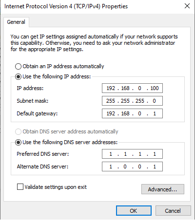

# GTA V  Settings
> by ***[9kLips](https://steamcommunity.com/id/9klips/)***

## How to install:-

### Download [settings.xml](settings.xml) and place it here: 
> C:\Users\<username>\Documents\Rockstar Games\GTA V 
**Make it read only**

### Download [commandline.txt](commandline.txt) and place it here:
> ....\Steam\steamapps\common\Grand Theft Auto V

## Steam Launch Option:
> -fullscreen -high

## Change Network Adapter connection priority through the Metric value:
Open Control Panel -> Network & Sharing Center -> Change Adapter settings -> RMB Properties -> IPv4 Properties -> Advance 
and uncheck [ ] "Automatic Metric". Write `1` in "Interface Metric". 1 = Primary Network.
Do same for rest network adapters. With higher values than 1.

## Miscellaneous Settings:-

* **IMPORTANT:** It doesn't matter on which drive you install GTA V but you need to install Rockstar Launcher and Social Club in C:\ drive. Steam will download and install them as well as login with your rockstar account for you automatically when you install GTA V from steam. If it doesn't happen then you will have infinite loading time when you open GTA V and will have Activation problem. Try uninstalling and reinstalling GTA V completely from scratch and clean all the leftover from your computer before reinstalling the game. Do remove all the rockstar softwares etc.

* Check [✔] Disable fullscreen optimization for all games. If not disabled, it will make your game run in boderless fullscreen mode which drops fps & increase input lag. It was introduced by Microsoft to show notification while you in a fullscreen program.
* [VibranceGUI](https://vibrancegui.com/) --> 65%
* Disable Steam Overlay from GTA V Properties in Steam. Steam overlay eats up huge amount of fps and causes stuttering.
* [Give your pc static ip](https://i.imgur.com/NcJvd1t.png)

* [Give your PC a static IP from your router. Then forward the ports shown below. After that Enable DMZ and UPnP in your router:-](https://imgur.com/a/rJ9xmjz
)

